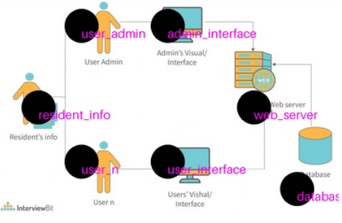

# gemini-visual-grounding

## LMM predictions with Set of Marks

[Set of Marks](https://arxiv.org/abs/2310.11441) is a technique to prompt LMMs adding visual grounding abilities. This provides better user experience and easier corrective action for some misidentified components. User and the model can refer to the marks with labels in subsequent contextual conversation.

## Installation

The code was tested on Python 3.11.0. To install the required packages, run the following command:
```python
pip install -r requirements.txt
```

## Usage

To run the code, execute the following command:
```python
streamlit run main.py
```

You need a [Gemini API key](https://aistudio.google.com/app/apikey) which is free to try out this application. Once you have entered the API key, follow the steps below:

1. Upload an image. 
2. The image is displayed with SoM.
3. Chat with the model with reference to set of marks for visually grounded responses.


## Examples

The following examples show the visual grounding of the LMM predictions with Set of Marks:

### Example 1

In the following example, the LMM predicts SoM for the flow diagram. The user can refer to the marks with labels in the subsequent conversation.



### Example 2

In the following examples, the LMM marks individual periodic elements. This can be a great tool for students/kids to interactively learn about the periodic table.


## Credits

[System Architecture Diagram](https://www.interviewbit.com/blog/system-architecture/) was taken from InterviewBit blog.\
[Periodic Table](https://www.energy.gov/articles/myfaveelement-high-school-contest) was taken from energy.gov. 